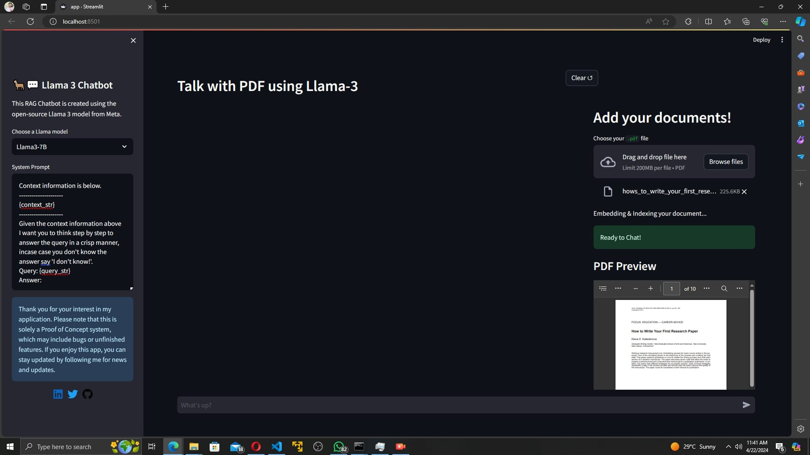

# Llama3 RAG Chatbot 🦙💬

Welcome to the Llama3 Chat with PDF Web App repository! This project showcases a powerful web application built using Streamlit, Meta's innovative Llama3 Language Model (LLM), and Hugging Face for embeddings. With this app, users can seamlessly interact with PDF documents, engage in chat conversations, and leverage the capabilities of the Llama3 LLM, all within a streamlined user interface and locally.

## Features

- **Chat with PDF:** Engage in interactive chat conversations while simultaneously viewing PDF documents.
- **PDF Preview:** Quickly preview PDF files directly within the web app interface.
- **System Prompt Display:** Display system prompts for a smoother user experience.
- **On-device LLM and embeddings:** Enjoy the benefits of on-device processing for enhanced performance and privacy.

## Dependencies

- Streamlit: [link](https://streamlit.io/)
- Meta's Llama3 LLM: [link](https://llama.meta.com/)
- Hugging Face Embeddings: [link](https://huggingface.co/)
- Llamaindex for LLM orchestration: [link](https://www.llamaindex.ai/)

## Installation

1. Clone this repository to your local machine

   ```bash
   git clone https://github.com/Safiullah-Rahu/Llama3-RAG-Chatbot.git
   ```
2. Navigate to the project directory
   ```bash
   cd Llama3-RAG-Chatbot
   ```
3. Install the required dependencies
   ```bash
   pip install -r requirements.txt
   ```
## Usage
1. Launch the Streamlit app
  ```bash
  streamlit run app.py
  ```
2. Access the web app via your web browser at `http://localhost:8501`.

## Demo


## Contributing
Contributions to this project are welcome! If you'd like to contribute, please follow these steps:

1. Fork this repository.
2. Create a new branch for your feature.
3. Make your changes and commit them.
4. Push to the branch.
5. Create a new pull request.

## License
This project is licensed under the MIT License - see the LICENSE file for details.


Follow me at:
<div id="badges">
  <a href="https://www.linkedin.com/in/safiullahrahu/">
    
  </a>
  <a href="https://github.com/Safiullah-Rahu">
    
  </a>
  <a href="https://www.twitter.com/safiullah_rahu">
    
  </a>
</div>
  
